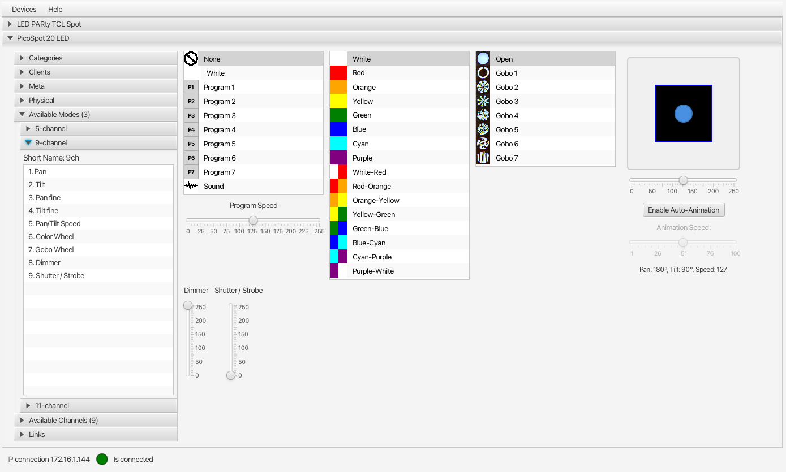

# DMX512 JavaFX Demo Application

Demo JavaFX application using the [DMX512 Java library](https://github.com/codewriterbv/DMX512).

**THIS PROJECT IS IN AN EARLY STAGE! BREAKING CHANGES ARE EXPECTED...**

## Detailed Description

Check this blog post for more
info: [Introducing a New Java DMX512 Library With Demo JavaFX User Interface](https://webtechie.be/post/2025-07-17-introducing-java-dmx512-library-with-demo-javafx-ui/).

## Introduction Video

A full explanation is available on YouTube:

